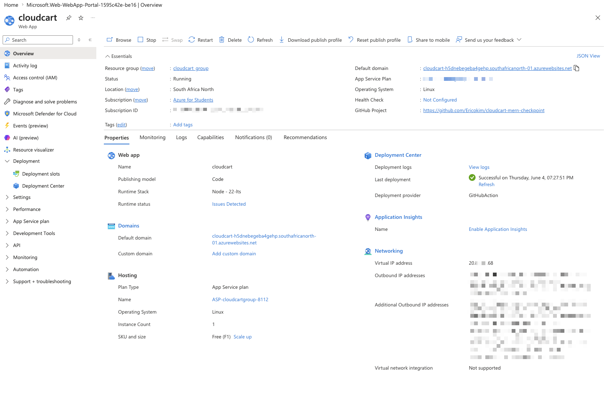

# CloudCart MERN Checkpoint

**CloudCart** is a full-stack e-commerce application built with the MERN stack (MongoDB, Express, React, Node.js). It provides a modern, responsive shopping experience with product browsing, filtering, and order management capabilities.

## 🚀 Live Demo

**Deployed Application:** [https://cloudcart-h5dnebegeba4gehp.southafricanorth-01.azurewebsites.net/](https://cloudcart-h5dnebegeba4gehp.southafricanorth-01.azurewebsites.net/)

Hosted on Azure App Service with continuous deployment via GitHub Actions.



## Tech Stack

- **Database:** MongoDB Atlas for scalable data storage
- **Backend:** Node.js, Express.js with Mongoose ODM
- **Frontend:** React with Vite for fast development and optimized builds
- **Styling:** Tailwind CSS with a warm, card-based UI theme
- **HTTP Client:** Axios for seamless API communication
- **Deployment:** Azure App Service with CI/CD via GitHub Actions

## Project Structure

```txt
cloudcart-mern-checkpoint/
  frontend/ React storefront
    src/components/
    src/hooks/
    src/lib/api/
    src/pages/
    src/styles/
  backend/  Express API, controllers, routes, middleware, models, seeders
  .env      Local backend configuration
```

## Features

- Product listing from MongoDB.
- Controller and route based Express API.
- Order validation and centralized error middleware.
- Starter product seeding on first server run.
- Manual seed scripts for resetting products and orders.
- Cart management in React.
- Search, stock filter, and product sorting.
- Axios API client under `frontend/src/lib/api`.
- Tailwind CSS styling with a warm card-based theme.
- Simple order submission.
- Recent order API for deployment verification.
- Production static serving from `backend/public`.
- One-command local development with `concurrently`.
- Environment-variable based configuration.

## Local Setup

### 1. Configure MongoDB

Create `.env` from the example at the project root:

```bash
cp .env.example .env
```

Add your MongoDB Atlas connection string:

```env
MONGO_URI=<your-mongodb-atlas-connection-string>
PORT=5001
NODE_ENV=development
CLIENT_URL=<your-local-client-url>
JWT_SECRET=<your-jwt-secret>
JWT_EXPIRY=24h
```

Do not commit the real `.env` file.

For quick local review, CloudCart can run without `MONGO_URI`. In that case, the backend uses in-memory demo data. For real deployment, configure MongoDB Atlas with `MONGO_URI`.

### 2. Install Dependencies

From the project root:

```bash
npm run install:all
```

### 3. Run the Full App

From the project root:

```bash
npm run dev
```

This runs:

- Express API with `nodemon`
- React frontend with Vite

The default local API port is `5001`, and the Vite dev server proxies `/api` requests to it.

### Optional: Run Each App Separately

Backend:

```bash
npm run server
```

The backend exposes:

- `GET /api/health`
- `GET /api/products`
- `POST /api/orders`
- `GET /api/orders`

### Optional: Reset Seed Data

Import starter products and clear existing orders/products:

```bash
npm run data:import
```

Destroy products and orders:

```bash
npm run data:destroy
```

Frontend:

In a second terminal:

```bash
cd frontend
npm run dev
```

The Vite dev server proxies `/api` requests to the local Express server.

If you deploy the frontend separately from the backend, create `frontend/.env`:

```env
VITE_API_BASE=<server-url>
```

## Production Build

Build the React frontend:

```bash
cd frontend
npm run build
```

Copy the build output into the backend public folder:

```bash
mkdir -p ../backend/public
cp -R dist/* ../backend/public/
```

Start the production server:

```bash
cd ..
NODE_ENV=production npm start
```

## MongoDB Atlas Setup

1. Create a MongoDB Atlas account.
2. Create a cluster.
3. Create a database user.
4. Configure Network Access.
5. Copy the connection string.
6. Set the connection string as `MONGO_URI`.

## Vercel

This project keeps `vercel.json` minimal like the Survey app. Configure `MONGO_URI` in Vercel if you later add a Vercel backend route or deploy the backend separately.

In Vercel project settings, configure:

```txt
MONGO_URI=<your-mongodb-atlas-connection-string>
NODE_ENV=production
```

Then deploy from the project root:

```bash
vercel
```

For production:

```bash
vercel --prod
```

## Deployment Test Checklist

- Homepage loads.
- Product cards display from MongoDB.
- Cart add/remove/quantity actions work.
- Order submission works.
- `GET /api/health` returns `status: ok`.
- No real secrets are committed.

## Notes

This project intentionally avoids authentication and payments. The checkpoint goal is to prove that a MERN app can be prepared, configured, deployed, and tested.
